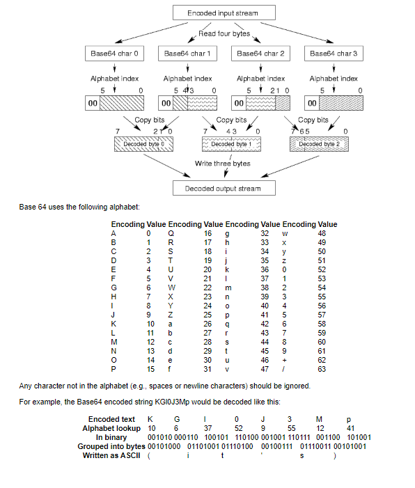

# base64Decoder

One of these encoding methods is called Base 64. It encodes three bytes (24 bits) of the input file by splitting them into four 6-bit blocks. 
These blocks are then written as four safe ASCII characters, each of which has 64 (26) possible values. 
The decoding process simply performs the steps in reverse. The following diagram illustrates the decoding process.

</img> 

